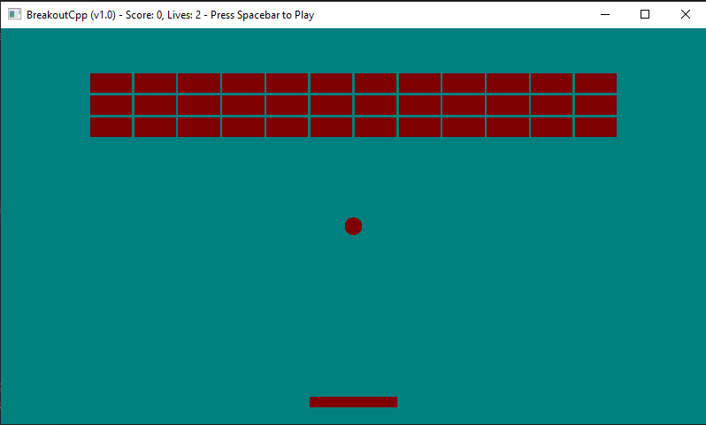

# BreakoutCpp

This is a very simple breakout game I created in c++ with data-oriented design. You can find my blog posts related to this project [here](https://www.mattgibson.dev/blog/?tag=BreakoutCpp&asc).

# Instructions
Move your paddle to keep the ball from flying off the bottom of the screen. You have 3 lives and get 1 point for every tile you hit. Once you destroy all the tiles a new level will start, the tiles will be more durable and the speed of the ball will be faster. Look at the top window bar for your score, lives remaining and other instructions.

## Controls
- Space Bar: Play and Pause Game
- Move Left: A or Left Arrow  
- Move Right: D or Right Arrow

# Building for Windows
- Make sure you have [mingw-w64](http://mingw-w64.org/) installed
- Run `win-build-debug.bat` or `win-build-release.bat`
- The executable will be created in `bin\win-debug` or `bin\win-release`

# Building for Mac
- Run `mac-build-debug.sh` or `mac-build-release.sh`
- The executable will be created in `bin/mac-debug` or `bin/mac-release`

# Using Visual Studio Code
There are tasks setup to build and debug windows and mac builds.  
(On windows you may need to change the path to your mingw-w64 gdb)
